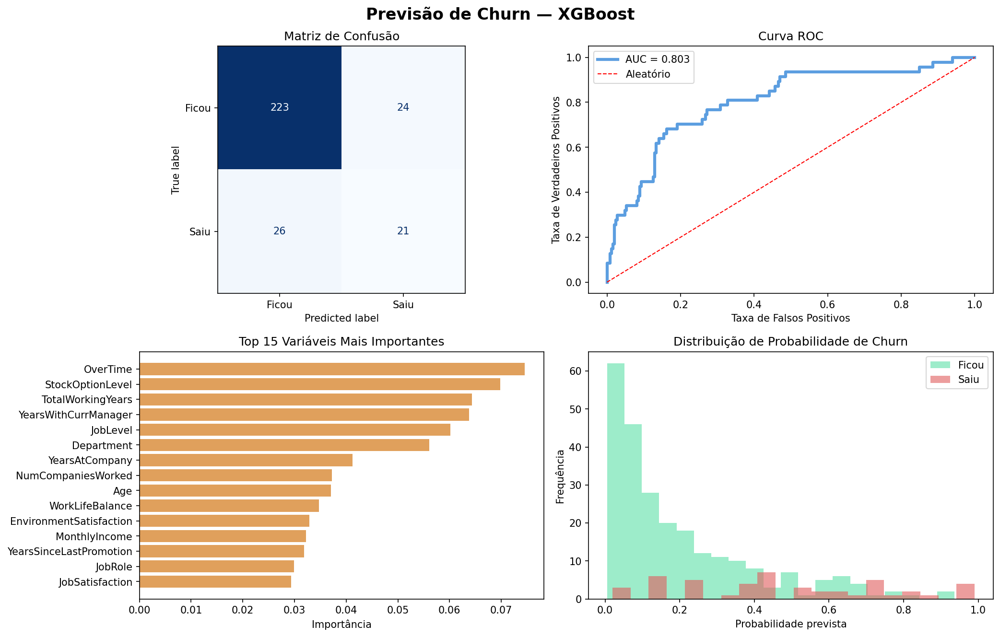
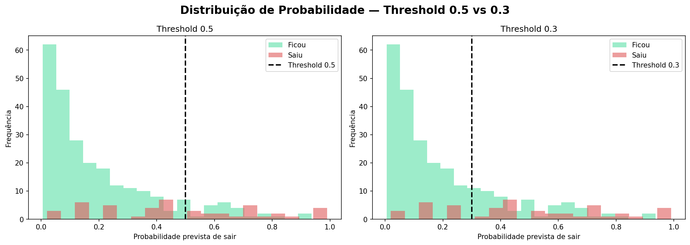
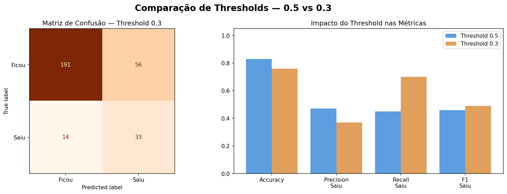

# 📉 Previsão de Churn — XGBoost

Modelo de classificação para prever quais funcionários têm maior probabilidade de deixar a empresa, com análise de threshold orientada a negócio e comparação de métricas.

## Como foi feito

Utilizamos o dataset real de RH da IBM com 1.470 funcionários. O modelo XGBoost foi treinado com `scale_pos_weight=5` para compensar o desbalanceamento — apenas 16% dos funcionários saíram. Após o treinamento, o threshold de decisão foi ajustado de 0.5 para 0.3 com base em uma análise de custo de negócio.

## Base de dados

Dataset real de RH da IBM com 1.470 registros e 35 variáveis sobre funcionários:

| Label | Descrição | Quantidade |
|---|---|---|
| No | Funcionário permaneceu | 1.233 |
| Yes | Funcionário saiu (churn) | 237 |

## Decisão de negócio — ajuste de threshold

O threshold padrão de 0.5 identifica apenas 45% dos churns reais. Mas do ponto de vista de negócio:

- **Custo de deixar passar um churn** — funcionário treinado sai, empresa perde o investimento e precisa contratar e treinar outro. Alto custo.
- **Custo de falso alarme** — RH chama um funcionário satisfeito para uma conversa e oferece um benefício desnecessário. Baixo custo.

Como o custo de perder um funcionário é muito maior que o custo de uma conversa desnecessária, o threshold foi reduzido para **0.3**, aceitando mais falsos alarmes em troca de identificar mais churns reais.

## Resultados

| Threshold | Accuracy | Recall Churn | Precision Churn | F1 Churn |
|---|---|---|---|---|
| 0.5 (padrão) | 83% | 45% | 47% | 46% |
| 0.3 (negócio) | 76% | **70%** | 37% | 49% |

Com threshold 0.3, o modelo passou a identificar **70% dos funcionários que vão sair** — de cada 10 churns reais, 7 são detectados antes de acontecer.

## O que os gráficos mostram

- **Matriz de confusão** — erros e acertos com threshold padrão
- **Curva ROC (AUC=0.803)** — capacidade de separação do modelo em todos os thresholds
- **Feature importance** — as 15 variáveis mais determinantes para prever o churn
- **Distribuição de probabilidade** — comparação visual do impacto do threshold 0.5 vs 0.3
- **Comparação de métricas** — tradeoff entre recall e precision nos dois thresholds

## Tecnologias

- Python 3
- pandas e NumPy — manipulação dos dados
- XGBoost — modelo de classificação com gradient boosting
- scikit-learn — métricas, matriz de confusão e curva ROC
- matplotlib — visualizações

## Como rodar

1. Clique no badge **Open in Colab** acima
2. Vá em `Runtime > Run all`
3. O dataset é carregado automaticamente via URL

## Resultado

